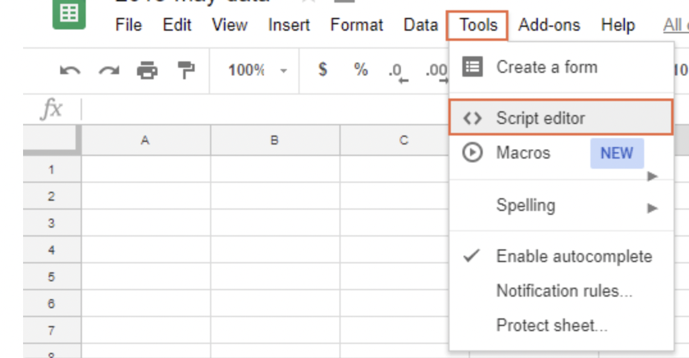

# GAS_send_email_from_spreadsheet
Google Apps Scripts to send an email by Gmail based on the information such as the email address described in the spreadsheet.
 I'm sorry if my English is strange

---
## Requirement
- Google Account

---
## Usage
1. Create a Google spreadsheet.
2. Open script editor.
    
3. Copy and paste the contents of main.gs in the repository to your Code.gs.
4. After creating an HTML file named "contents", copy and paste the contents of contents.html.
    
5. Change the contents of HTML, script files, and spreadsheets as needed.
6. Run the script to send an email.

---

## Attention
There are restrictions on the emails sent by GAS. 
If you have a Google Workspace account, you can send up to 1500 messages per day. 
For other accounts, you can send up to 100 messages per day.
